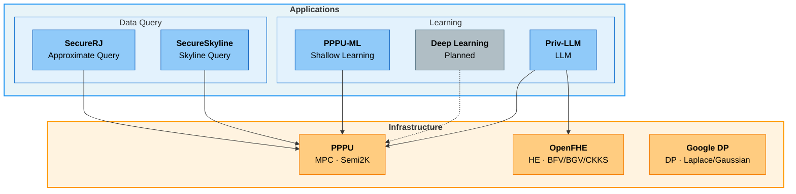

[**English**](https://github.com/nezha-privacy/.github/blob/main/profile/README.md) | [**中文**](https://github.com/nezha-privacy/.github/blob/main/profile/README_ZH.md)

# Nezha Privacy

> **Privacy-Preserving Computation, From Operators to Algorithms.**

---

## Architecture

---

## Repository Index

### Infrastructure

| Repository | Description | Source |
|:-----------|:------------|:------:|
| [**PPPU**](https://github.com/nezha-privacy/PPPU) | **MPC** — Privacy Processing Unit. Secure multi-party computation primitives under the Semi2K protocol, including arithmetic, comparison, math, and shape operations. | Self-hosted |
| [**OpenFHE**](https://github.com/openfheorg/openfhe-development) | **HE** — Homomorphic Encryption library. Supports BFV, BGV, CKKS, TFHE/FHEW schemes with Threshold FHE and Proxy Re-Encryption. | External |
| [**Google DP**](https://github.com/google/differential-privacy) | **DP** — Differential Privacy library. Production-grade Laplace/Gaussian mechanisms, DP aggregations (Count, Sum, Mean, Variance, Quantiles), and privacy budget accounting. | External |

### Applications

#### Learning

| Repository | Category | Description | Status |
|:-----------|:---------|:------------|:------:|
| [**PPPU-ML**](https://github.com/nezha-privacy/PPPU-ML) | Shallow Learning | Machine learning module built on PPPU — linear regression, logistic regression, decision tree. | Private |
| *(Planned)* | Deep Learning | — | — |
| [**Priv-LLM**](https://github.com/nezha-privacy/Priv-LLM) | LLM | A unified privacy-preserving framework for large language model training and inference. | Private |

#### Data Query

| Repository | Description | Status |
|:-----------|:------------|:------:|
| [**SecureRJ**](https://github.com/nezha-privacy/SecureRJ) | An approximate query framework built on ABY3 secure multi-party computation. Supports Join, GroupBy, Sort, Sampling, and more. | Private |
| [**SecureSkyline**](https://github.com/nezha-privacy/SecureSkyline) | A privacy-preserving Skyline query framework built on PPPU MPC primitives. Computes Pareto-optimal results across multi-party data. | Private |

---

## Tech Stack

| Layer | Technologies |
|:------|:-------------|
| Language | C++20 (GCC 13+) |
| MPC Protocols | Semi2K (SPDZ2k), ABY3 |
| HE Schemes | BFV, BGV, CKKS, TFHE/FHEW (via [OpenFHE](https://github.com/openfheorg/openfhe-development)) |
| DP Mechanisms | Laplace, Gaussian, DP Aggregations (via [Google DP](https://github.com/google/differential-privacy)) |
| Core Libraries | GMP, Boost, OpenMP, Eigen |
| Networking | Boost.Asio, OpenSSL |
| Build System | CMake, Bazel |
| Containerization | Docker |

---

## Team

Nezha Privacy is developed at the **State Key Laboratory of Networking and Switching Technology, Beijing University of Posts and Telecommunications (BUPT)**.

**Leader:**

| | Name | GitHub |
|:--|:-----|:------:|
| **PI** | Cheng Xiang | [@chengxiangbupt](https://github.com/chengxiangbupt) |

**Members:**

| GitHub | Profile |
|:-------|:-------:|
| [@JiangZhiyu-1024](https://github.com/JiangZhiyu-1024) | [Profile](https://github.com/JiangZhiyu-1024) |
| [@Jumdar](https://github.com/Jumdar) | [Profile](https://github.com/Jumdar) |
| [@Jun-g1e](https://github.com/Jun-g1e) | [Profile](https://github.com/Jun-g1e) |
| [@kk141103](https://github.com/kk141103) | [Profile](https://github.com/kk141103) |
| [@Murlocccc](https://github.com/Murlocccc) | [Profile](https://github.com/Murlocccc) |
| [@qazw52](https://github.com/qazw52) | [Profile](https://github.com/qazw52) |
| [@vctwwd](https://github.com/vctwwd) | [Profile](https://github.com/vctwwd) |
| [@zcbbb266](https://github.com/zcbbb266) | [Profile](https://github.com/zcbbb266) |

---

## Contributing

We welcome contributions! Please follow these steps:

1. **Fork** the target repository to your account
2. **Create a feature branch** (`feat/xxx`, `fix/xxx`, `docs/xxx`)
3. **Develop and commit** with clear commit messages
4. **Push** to your fork and create a **Pull Request**
5. **Request review** before merging

> **Guides:**
>
> | Document | Description |
> |:---------|:------------|
> | [Contribution Guide (PDF)](https://github.com/nezha-privacy/PPPU/blob/main/doc/development/2_Nezha%20privacy%20%E8%B4%A1%E7%8C%AE%E6%8C%87%E5%8D%97.pdf) | Contribution guide for the Nezha Privacy project |
> | [OpenCode Development Guide](https://github.com/nezha-privacy/PPPU/blob/main/doc/development/opencode-guide.md) | Guide for developing with OpenCode |
>
> For detailed contribution guidelines, see the documentation in each repository.

---

## License

Each repository has its own license. See the `LICENSE` file in each repository for details.
