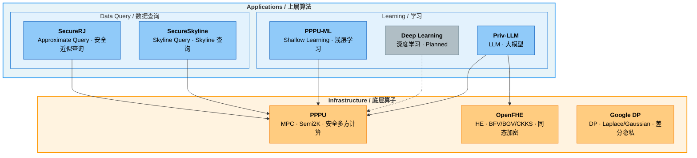

# Nezha Privacy

> **Privacy-Preserving Computation, From Operators to Algorithms.**
>
> **隐私计算，从算子到算法。**

---

## Architecture / 项目架构

---

## Repository Index / 仓库索引

### Infrastructure / 底层算子

| Repository | Description | Source |
|:-----------|:------------|:------:|
| [**PPPU**](https://github.com/nezha-privacy/PPPU) | **MPC** — Privacy Processing Unit. Secure multi-party computation primitives under the Semi2K protocol, including arithmetic, comparison, math, and shape operations.   **安全多方计算** — 隐私计算处理单元，提供 Semi2K 协议下的算术、比较、数学、排序等安全计算原语。 | Self-hosted |
| [**OpenFHE**](https://github.com/openfheorg/openfhe-development) | **HE** — Homomorphic Encryption library. Supports BFV, BGV, CKKS, TFHE/FHEW schemes with Threshold FHE and Proxy Re-Encryption.   **同态加密** — 支持 BFV、BGV、CKKS、TFHE/FHEW 全方案，内置门限同态加密与代理重加密。 | External |
| [**Google DP**](https://github.com/google/differential-privacy) | **DP** — Differential Privacy library. Production-grade Laplace/Gaussian mechanisms, DP aggregations (Count, Sum, Mean, Variance, Quantiles), and privacy budget accounting.   **差分隐私** — 生产级 Laplace/Gaussian 机制、DP 聚合算法、隐私预算管理。 | External |

### Applications / 上层算法

#### Learning / 学习

| Repository | Category | Description | Status |
|:-----------|:---------|:------------|:------:|
| [**PPPU-ML**](https://github.com/nezha-privacy/PPPU-ML) | Shallow Learning / 浅层学习 | Machine learning module built on PPPU — linear regression, logistic regression, decision tree.   基于 PPPU 的机器学习模块 — 线性回归、逻辑回归、决策树。 | Private |
| *(Planned)* | Deep Learning / 深度学习 | — | — |
| [**Priv-LLM**](https://github.com/nezha-privacy/Priv-LLM) | LLM / 大模型 | A unified privacy-preserving framework for large language model training and inference.   面向大语言模型训练与推理的统一隐私保护框架。 | Private |

#### Data Query / 数据查询

| Repository | Description | Status |
|:-----------|:------------|:------:|
| [**SecureRJ**](https://github.com/nezha-privacy/SecureRJ) | An approximate query framework built on ABY3 secure multi-party computation. Supports Join, GroupBy, Sort, Sampling, and more.   基于 ABY3 安全多方计算的近似查询框架，支持 Join、GroupBy、Sort、Sampling 等操作。 | Private |
| [**SecureSkyline**](https://github.com/nezha-privacy/SecureSkyline) | A privacy-preserving Skyline query framework built on PPPU MPC primitives. Computes Pareto-optimal results across multi-party data.   基于 PPPU 安全多方计算的隐私保护 Skyline 查询框架，支持多方数据上的帕累托最优计算。 | Private |

---

## Tech Stack / 技术栈

| Layer | Technologies |
|:------|:-------------|
| Language | C++20 (GCC 13+) |
| MPC Protocols | Semi2K (SPDZ2k), ABY3 |
| HE Schemes | BFV, BGV, CKKS, TFHE/FHEW (via [OpenFHE](https://github.com/openfheorg/openfhe-development)) |
| DP Mechanisms | Laplace, Gaussian, DP Aggregations (via [Google DP](https://github.com/google/differential-privacy)) |
| Core Libraries | GMP, Boost, OpenMP, Eigen |
| Networking | Boost.Asio, OpenSSL |
| Build System | CMake, Bazel |
| Containerization | Docker |

---

## Contributing / 参与贡献

We welcome contributions! Please follow these steps:

欢迎参与贡献！请遵循以下流程：

1. **Fork** the target repository to your account / Fork 目标仓库到你的账号
2. **Create a feature branch** (`feat/xxx`, `fix/xxx`, `docs/xxx`) / 创建功能分支
3. **Develop and commit** with clear commit messages / 开发并提交，使用清晰的提交信息
4. **Push** to your fork and create a **Pull Request** / 推送到你的 fork 并创建 PR
5. **Request review** before merging / 请求 Code Review 后再合并

> For detailed contribution guidelines, see the documentation in each repository.
>
> 详细的贡献指南请参阅各仓库中的文档。

---

## License / 许可证

Each repository has its own license. See the `LICENSE` file in each repository for details.

各仓库有各自的许可证，请参阅各仓库中的 `LICENSE` 文件。
