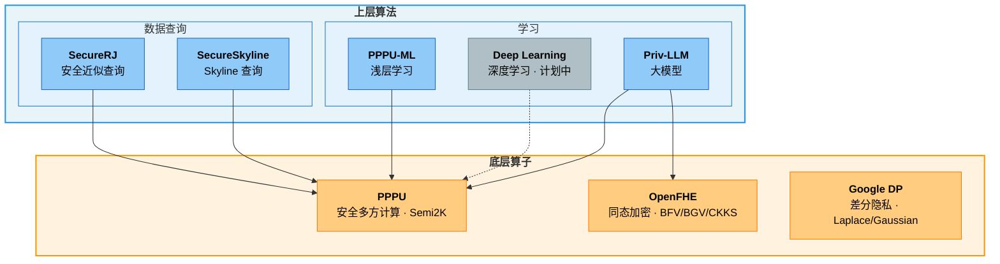

[**English**](https://github.com/nezha-privacy/.github/blob/main/profile/README.md) | [**中文**](https://github.com/nezha-privacy/.github/blob/main/profile/README_ZH.md)

# Nezha Privacy

> **隐私计算，从算子到算法。**

---

## 项目架构

---

## 仓库索引

### 底层算子

| 仓库 | 说明 | 来源 |
|:-----|:-----|:----:|
| [**PPPU**](https://github.com/nezha-privacy/PPPU) | **安全多方计算** — 隐私计算处理单元，提供 Semi2K 协议下的算术、比较、数学、排序等安全计算原语。 | 自研 |
| [**OpenFHE**](https://github.com/openfheorg/openfhe-development) | **同态加密** — 支持 BFV、BGV、CKKS、TFHE/FHEW 全方案，内置门限同态加密与代理重加密。 | 外部 |
| [**Google DP**](https://github.com/google/differential-privacy) | **差分隐私** — 生产级 Laplace/Gaussian 机制、DP 聚合算法（Count、Sum、Mean、Variance、Quantiles）、隐私预算管理。 | 外部 |

### 上层算法

#### 学习

| 仓库 | 类别 | 说明 | 状态 |
|:-----|:-----|:-----|:----:|
| [**PPPU-ML**](https://github.com/nezha-privacy/PPPU-ML) | 浅层学习 | 基于 PPPU 的机器学习模块 — 线性回归、逻辑回归、决策树。 | 私有 |
| *（计划中）* | 深度学习 | — | — |
| [**Priv-LLM**](https://github.com/nezha-privacy/Priv-LLM) | 大模型 | 面向大语言模型训练与推理的统一隐私保护框架。 | 私有 |

#### 数据查询

| 仓库 | 说明 | 状态 |
|:-----|:-----|:----:|
| [**SecureRJ**](https://github.com/nezha-privacy/SecureRJ) | 基于 ABY3 安全多方计算的近似查询框架，支持 Join、GroupBy、Sort、Sampling 等操作。 | 私有 |
| [**SecureSkyline**](https://github.com/nezha-privacy/SecureSkyline) | 基于 PPPU 安全多方计算的隐私保护 Skyline 查询框架，支持多方数据上的帕累托最优计算。 | 私有 |

---

## 技术栈

| 层次 | 技术 |
|:-----|:-----|
| 编程语言 | C++20 (GCC 13+) |
| MPC 协议 | Semi2K (SPDZ2k), ABY3 |
| HE 方案 | BFV, BGV, CKKS, TFHE/FHEW（通过 [OpenFHE](https://github.com/openfheorg/openfhe-development)） |
| DP 机制 | Laplace, Gaussian, DP 聚合（通过 [Google DP](https://github.com/google/differential-privacy)） |
| 核心库 | GMP, Boost, OpenMP, Eigen |
| 网络 | Boost.Asio, OpenSSL |
| 构建系统 | CMake, Bazel |
| 容器化 | Docker |

---

## 参与贡献

欢迎参与贡献！请遵循以下流程：

1. **Fork** 目标仓库到你的账号
2. **创建功能分支**（`feat/xxx`、`fix/xxx`、`docs/xxx`）
3. **开发并提交**，使用清晰的提交信息
4. **推送**到你的 fork 并创建 **Pull Request**
5. **请求 Code Review** 后再合并

> **开发文档：**
>
> | 文档 | 说明 |
> |:-----|:-----|
> | [Nezha Privacy 贡献指南 (PDF)](https://github.com/nezha-privacy/PPPU/blob/main/doc/development/2_Nezha%20privacy%20%E8%B4%A1%E7%8C%AE%E6%8C%87%E5%8D%97.pdf) | 项目贡献指南 |
> | [使用 OpenCode 开发指南](https://github.com/nezha-privacy/PPPU/blob/main/doc/development/opencode-guide.md) | 使用 OpenCode 进行开发的指南 |
>
> 详细的贡献指南请参阅各仓库中的文档。

---

## 许可证

各仓库有各自的许可证，请参阅各仓库中的 `LICENSE` 文件。
